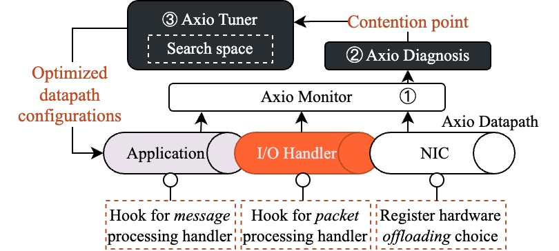

# axio-emulator
<!-- PipeTune is an efficient performance tuning framework for host datapaths. It correlates three crucial datapath configurations (i.e., core number, queue number and batch size) with memory efficiency, further translating to datapath performance to derive effective tuning strategies. Building upon them, we implemented PipeTune to automatically search for the optimal configuration values to achieve consistently high performance. -->

<!-- The detail of PipeTune is described in our paper: [Tuning Host Datapath Performance with PipeTune](https://github.com/Huangxy-Minel/Paper-DPerf). -->

<!-- ----------------------------------------------------------------- -->
## Catalog
1. [Features](#features)
2. [Quick Start](#quick-start)
3. [Customize Axio Datapath](#customize-pipetune-datapath)
4. [Axio Tuner (Coming Soon)](#pipetune-tuner)
5. [Troubleshooting](#trouble)

## <a name="features"></a>1. Features
- **Datapath**: Axio datapath can emulate datapath performance of real-world applications, which provides two types of emulation hooks, i.e., message-based handler and packet-based handler.
- **Tuner**: Axio Tuner can automatically search for the optimal configuration values of core number, queue number and batch size.

The following figure shows the architecture of axio-emulator.
<div style="text-align: center;">

</div>

Note that the **Axio Datapath can be used individually**, e.g., emulate the performance of a specific application or used as a perf-test tool.

<!-- ----------------------------------------------------------------- -->

## <a name="quick-start"></a>2. Quick Start
The following instructions will help you to quickly set up and run the Axio Datapath on your machine. 

### Test Environment
- Ubuntu 22.04
- Linux kernel 5.15.x
- DPDK 22.11.x
- Intel(R) Xeon(R) Silver 4309Y CPU @ 2.80GHz
- two-port 200G Ethernet Mellanox Connect-X 7
- PCIe 4.0 x 16
- 512GB DDR5 3200MT/s

### Install Prerequisites
Install with package manager (e.g., apt):
```bash
python3 toolchain/main.py -i
```
Install DPDK, if you have not installed it:
```bash
tar -xvf third_party/dpdk-22.11.3.tar.xz -C ./third_party/
bash third_party/build_dpdk.sh
```
Install Mellanox OFED, if you have not installed it. Please refer to the [official website](https://www.mellanox.com/products/infiniband-drivers/linux/mlnx_ofed) for installation.

**Important**: 
- Modify src/common.h to set the Node Type (CLIENT or SERVER), the Dispatcher Type (DPDK or RoCE) and the RoCE Type (UD or RC, only for RoCE Dispatcher). Update the server constants to your own servers.
- Modify config/send_config (for CLIENT) and config/recv_config (for SERVER) to set source and destination IP/MAC addresses and PCIe device ID. Currently, please replace all ':' to '.' for MAC addresses and PCIe device ID.

### Build axio-emulator
axio-emulator can be easily built if you have installed the prerequisites. 
```bash
meson setup build
ninja -C build
```
**Troubleshooting**: If you encounter any issues during the build process, please refer to the [Troubleshooting](#trouble) section.

### Run Axio Datapath Individually
**NOTE: Start the server first, then the client.**
```bash
sudo build/axio-emulator > tmp/temp.log
```
If success to run, you will see the following performance metrics:
```bash
---------------------------------------------------------------------------------------------------------------------------------------------------------------------------------------------------------------
Perf Statistics     Thpl. (Mpps)        Avg. [/P]           Avg. Stall [/P]     Max Stall. [/B]     Min Stall. [/B]     Avg Stall. [/B]     Max Coml. [/B]      Min Coml. [/B]      Avg Coml. [/B]      
---------------------------------------------------------------------------------------------------------------------------------------------------------------------------------------------------------------
End-to-end          20.046              0.050               
app_tx              0.000               0.000               0.000               0.000               9999.000            0.000000(0.272515)  0.000               9999.000            0.000               
app_rx              20.046              0.021               0.000               0.000               9999.000            0.000               21.787              1.693               2.957               
disp_tx             20.046              0.015               0.008               
disp_rx             20.046              0.027               0.014               
nic_tx              20.046              0.008          
nic_rx              38.854              0.103          
---------------------------------------------------------------------------------------------------------------------------------------------------------------------------------------------------------------
```

### Outputs of the Datapath Log File
1. **Thpl. (Mpps)**: Throughput in million packets per second.
2. **Avg. [/P]**: Average execution time per packet, which has been broken into different stages. E.g., avg. [/P] in app_tx is the average execution time per packet during the application TX stage.
3. **Avg. Stall [/P]**: Average pipeline stall stall time per packet, which has been broken into different stages. The stall time is included in the avg. [/P].
4. **Max/Min/Avg Stall. [/B]**: Maximum/minimum/average stall time per batch packets/messages.
5. **Max/Min/Avg Coml. [/B]**: Maximum/minimum/average completion time per batch packets/messages.

<!-- ----------------------------------------------------------------- -->

## <a name="customize-pipetune-datapath"></a>3. Customize Axio Datapath
This section provides a detailed guide on how to customize Axio datapath for your own applications, i.e., emulate the applications with message-based handler and packet-based handler.

### Hook Handler to Axio Datapath
#### Message-based Handler
1. Implement the message-based handler in 'src/ws_impl/msg_handlers.cc' and define the handler in 'src/workspace.h'. 
```cpp
template <class TDispatcher>
void Workspace<TDispatcher>::throughput_intense_app(MEM_REG_TYPE **mbuf_ptr, size_t pkt_num, udphdr *uh, ws_hdr *hdr) {
    for (size_t i = 0; i < pkt_num; i++) {
        // [step 1] scan the payload of the request
        scan_payload(*mbuf_ptr, kAppReqPayloadSize);

        // [step 2] set the payload of a response with same size
    #if ApplyNewMbuf
        cp_payload(tx_mbuf_buffer_[i], *mbuf_ptr, (char*)uh, (char*)hdr, 1);
        mbuf_ptr++;
    #else
        set_payload(*mbuf_ptr, (char*)uh, (char*)hdr, 1);
        mbuf_ptr++;
    #endif
    }
}
```
2. Register the message-based handler in 'src/common.h'. 
```cpp
enum msg_handler_type_t : uint8_t {
  kRxMsgHandler_Empty = 0,
  kRxMsgHandler_T_APP,
  kRxMsgHandler_L_APP,
  kRxMsgHandler_M_APP,
  kRxMsgHandler_FileDecompress,
  <Your Handler Type>
};
```
3. Change the message-based handler type (kRxMsgHandler) and set the application payload size (kAppReqPayloadSize) in 'src/common.h'.
```cpp
/* Message-level specification */
#define kRxMsgHandler <Your Handler Type>
#define ApplyNewMbuf false
static constexpr size_t kAppTicksPerMsg = 0;    // extra execution ticks for each message, used for more accurate emulation
// Corresponding MAC frame len: 22 -> 64; 86 -> 128; 214 -> 256; 470 -> 512; 982 -> 1024; 1458 -> 1500
constexpr size_t kAppReqPayloadSize = 
    (kRxMsgHandler == kRxMsgHandler_Empty) ? 0 :
    (kRxMsgHandler == kRxMsgHandler_T_APP) ? 982 :
    (kRxMsgHandler == kRxMsgHandler_L_APP) ? 86 :
    (kRxMsgHandler == kRxMsgHandler_M_APP) ? 86 :
    (kRxMsgHandler == kRxMsgHandler_FileDecompress) ? MB(2) : 0 :
    (kRxMsgHandler == kRxMsgHandler_<Your Handler Type>) ? <Your Payload Size> : 0;
static_assert(kAppReqPayloadSize > 0, "Invalid application payload size");
```
Note that we provide two types of payload size --- request and response. The request payload size is used for client-side operations, and the response payload size is used for server-side operations. For example, if you want to realize that the client sends a 64B-request and the server responds with a 100KB-response, you can set the request payload size to 64 and the response payload size to 100KB.

#### Packet-based Handler
1. For dpdk dispatcher, implement the packet-based handler in 'src/dispatcher_impl/dpdk/dpdk_pkt_handlers.cc' and define the handler in 'src/dispatcher_impl/dpdk/dpdk_dispatcher.h'. RoCE dispatcher is similar to dpdk dispatcher.
```cpp
size_t DpdkDispatcher::echo_handler() {
    size_t pre_dispatch_total = 0;
    rte_mbuf *mbuf;
    struct eth_hdr *eth = NULL;
    struct iphdr *iph = NULL;

    uint8_t tmp_eth_addr[ETH_ADDR_LEN] = {0};
    uint32_t tmp_ip_addr = 0;

    size_t remain_tx_queue_size = (kNumTxRingEntries - tx_queue_idx_ > rx_queue_idx_) 
                                    ? rx_queue_idx_ : kNumTxRingEntries - tx_queue_idx_;
    for (size_t i = 0; i < remain_tx_queue_size; i++) {
        mbuf = rx_queue_[i];
        eth = mbuf_eth_hdr(mbuf);
        iph = mbuf_ip_hdr(mbuf);

        // swap IP address
        tmp_ip_addr = iph->daddr;
        iph->daddr = iph->saddr;
        iph->saddr = tmp_ip_addr;

        // swap MAC address
        rte_memcpy(tmp_eth_addr, eth->d_addr.bytes, ETH_ADDR_LEN);
        rte_memcpy(eth->d_addr.bytes, eth->s_addr.bytes, ETH_ADDR_LEN);
        rte_memcpy(eth->s_addr.bytes, tmp_eth_addr, ETH_ADDR_LEN);

        // insert packets to tx queue
        tx_queue_[tx_queue_idx_] = mbuf;
        tx_queue_idx_++;

        pre_dispatch_total++;
    }
    for (size_t i = pre_dispatch_total; i < rx_queue_idx_; i++) rte_pktmbuf_free(rx_queue_[i]);
    rx_queue_idx_ = 0;
    return pre_dispatch_total;
}
```
2. Register the packet-based handler in 'src/common.h'. 
```cpp
enum pkt_handler_type_t : uint8_t {
  kRxPktHandler_Empty = 0,
  kRxPktHandler_Echo,
  <Your Handler Type>
};
```
3. Change the packet-based handler type (kRxPktHandler) in 'src/common.h'.
```cpp
/* Packet-level specification */
#define kRxPktHandler  <Your Handler Type>
```

### Customize Config File
Please refer to the 'config/template_config' to customize the configuration file for your own applications. Note that Sec 'Axio Tuner Configuration' is used for Axio Tuner, so you can ignore it if you only want to customize the datapath. The Sec 'Axio Datapath Configuration' is used for Axio Datapath.

We provide a simple verifier to check the configuration file.
```bash
python3 toolchain/main.py -c <Your Config File> -v
```
If success to check, you will see the following output:
```bash
==========Tunable Parameter Verification Passed==========
```
**Noted Limitations**
1. The verifier only checks part of the configuration values, e.g., core number and workload format.
2. The verifier cannot check the correctness of "one-consumer" assumption, so please check it manually.

### Rebuild and Run Axio Datapath
```bash
ninja -C build
sudo build/axio-emulator > tmp/temp.log
```
Hope you can enjoy the customization of Axio Datapath!

<!-- ----------------------------------------------------------------- -->

## <a name="pipetune-tuner"></a>4. Axio Tuner
This section provides a detailed guide on how to use Axio Tuner to search for the optimal configuration values of core number, queue number and batch size. We provide two ways to use Axio Tuner:
1. **Manually (recommend)**: manually run the Axio Datapath with metric-monitoring tools (e.g., perf) to collect the performance metrics. Levarage the Axio Diagnosis tool to obtain the contention point and tuning suggestions.
2. **Automatically (coming soon)**: automatically run the Axio Tuner to search for the optimal configuration values.

The reason why we recommend the manual way is that the automatic way is realized by many scripts, which may not be suitable for all environments. The manual way is more flexible and will help you understand the datapath performance and be familiar with the tuning process. Once you have mastered the manual way, you can try the automatic way ^_^.

### Manual Way
#### Setup the Performance Monitoring Tool
Our monitoring tool is based on [perf](https://www.brendangregg.com/perf.html) (collect LLC metrics) and [intel-pcm](https://github.com/intel/pcm) (collect IO metrics). They are already installed in the prerequisites. The monitoring tool is referenced from [HostCC](https://github.com/terabit-Ethernet/hostCC).

Below is the configuration of the monitoring tool, located at "scripts/host-metric/record-host-metrics.sh":
```bash
#=====================User-Specified Parameters=====================
dur=3
type=0
cpu_util=0
cores=20
pcm_pcie=1
pcm_mem=1
llc=1
pcm_iio=0
iio_occ=0
pfc=0
intf=rdma0
#=====================END=====================
```
Please modify below parameters according to your own environment:
- **dur**: sample duration of each monitored metric.
- **pcm_pcie**: 0 for not monitoring PCIe IO metrics, 1 for monitoring.
- **pcm_mem**: 0 for not monitoring memory IO metrics, 1 for monitoring.
- **llc**: 0 for not monitoring LLC metrics, 1 for monitoring.
- **intf**: the network interface name, e.g., "enp1s0f0" for 1st port.

#### Run Axio Datapath with Monitoring Tool
Run the datapath first:
```bash
sudo ./build/axio-emulator > tmp/temp.log
```
Wait for a while to make sure the datapath performance is stable, then run the monitoring tool:
```bash
sudo scripts/host-metric/record-host-metrics.sh
```
The profiling results will be saved in the "scripts/host-metric/reports/report.rpt".

#### Diagnose the Contention Point
We provide a simple python script to parse the monitoring results and diagnose the contention point. The script is located at "toolchain/main.py".
```bash
python3 toolchain/main.py \
-c <Your config file for Axio Datapath> \
-m <Your metric output file generated by the monitoring tool> \
-d <The output file of Axio Datapath> \
-p
```

If success to run, you will see the following output:
```bash
[INFO] Diagnosing the contention point for local......
==========Performance Statistics==========
[DEBUG] End-to-end Throughput: 20.188
[DEBUG] Completion time: [0.0, 0.021, 0.015, 0.027, 0.008, 0]
[DEBUG] Stall time: [0.0, 0.0, 0.008, 0.014]
[DEBUG] IO Read Miss Rate: 0.0
[DEBUG] IO Write Miss Rate: 0.89
[DEBUG] LLC Read Miss Rate: 0.11
[DEBUG] LLC Write Miss Rate: 0.1
[INFO] The most critical pipe phase is: disp_rx
[INFO] The completion time < stall time. Contention point is C1.
```

### Automatic Way (Coming Soon)
#### Specifications of Configuration File
Axio Tuner requires users to provide a configuration file to specifiy the search space of core number, queue number and batch size. There are two things to keep in mind：
1. Specify the maximum value of core number and queue number.
```bash
kAppCoreNum         : 8
kDispQueueNum       : 8
```
2. Specify the search space corresponding to each workload.
```bash
workload : 1 : RXNIC,RXDispatcher,RxApplication,TxDispatcher,TxNIC : 0,1,2,3 : 0|1|2|3 : 0|1|2|3
workload : 2 : RXNIC,RXDispatcher,RxApplication,TxDispatcher,TxNIC : 4,5,6,7 : 4|5|6|7 : 4|5|6|7
```
This configuration means there are two types of workloads (workload 1 and workload 2). For workload 1, the search space of core number and queue number is [0, 1, 2, 3]. For workload 2, the search space of core number and queue number is [4, 5, 6, 7]. This should be the maximum search space which means the tuner will not add more cores or queues beyond these specified core/queue ids.

Axio Tuner will try to re-arrange the combination of specified cores and queues to find the optimal configuration values.

#### Preqrequisites of Axio Tuner
1. Make sure the configuration file is correct by following the [3. Customize Axio Datapath](#customize-pipetune-datapath) section.
2. If step one is passed, modify the 'src/common.h' to set the ENABLE_TUNE to true and recompile.
```cpp
#define ENABLE_TUNE true
```
3. Make sure axio-emulator repo is located in the same directory at both the client and server sides. Make sure the users of the client and server sides are the same.
4. Config no-passwd ssh between the client and server sides. Config no-passwd sudo between the client and server sides.

#### Run Axio Tuner
Only run the Axio Tuner at the Server side.
```bash
python3 toolchain/main.py -c <Your Config File> \
-t <tuning iteration> \
<-p, if you want to print the configurations each iter> \
<-v, if you want to verify the configurations each iter>
```
If success to run, the optimized configuration values will be written to the 'config/send_config.out' or 'config/recv_config.out' file. The following is an example of the output:
```bash
# -----------------Axio Tuner Configuration-----------------
kAppCoreNum : 4
kAppRxMsgBatchSize : 32
kAppTxMsgBatchSize : 32
kDispQueueNum : 4
kDispRxBatchSize : 128
kDispTxBatchSize : 32
kNICRxPostSize : 32
kNICTxPostSize : 32

# -----------------Axio Datapath Configuration-----------------
workload : 1 : RXNIC,RXDispatcher,RxApplication,TxDispatcher,TxNIC : 0 : 0 : 0
workload : 2 : RXNIC,RXDispatcher,RxApplication,TxDispatcher,TxNIC : 1 : 1 : 1
workload : 3 : RXNIC,RXDispatcher,RxApplication,TxDispatcher,TxNIC : 2 : 2 : 2
workload : 4 : RXNIC,RXDispatcher,RxApplication,TxDispatcher,TxNIC : 3 : 3 : 3

numa : 1
phy_port : 0
iteration : 10
duration : 1

local_ip : 10.0.2.102
remote_ip : 10.0.2.101
local_mac : 10.70.fd.87.0e.ba
remote_mac : 10.70.fd.6b.93.5c
device_pcie : 0000.98.00.0
```

At tmp/axio-emulator_iter_<iter_num>.log, you will see the performance metrics of each iteration.
```bash
---------------------------------------------------------------------------------------------------------------------------------------------------------------------------------------------------------------
DPerf Statistics    Thpl. (Mpps)        Avg. [/P]           Avg. Stall [/P]     Max Stall. [/B]     Min Stall. [/B]     Avg Stall. [/B]     Max Coml. [/B]      Min Coml. [/B]      Avg Coml. [/B]      
---------------------------------------------------------------------------------------------------------------------------------------------------------------------------------------------------------------
End-to-end          0.000               0.000               
app_tx              19.464              0.111               0.003               8.289               0.063               0.095814(0.279753)  35.121              1.368               3.456               
app_rx              19.464              0.016               0.000               0.000               9999.000            0.000               11.779              0.398               1.207               
disp_tx             19.464              0.019               0.011               
disp_rx             19.464              0.030               0.014               
nic_tx              19.464              0.011          
nic_rx              11.324              0.357          
---------------------------------------------------------------------------------------------------------------------------------------------------------------------------------------------------------------
```

## <a name="trouble"></a>5. Troubleshooting
If you encounter any issues during the build process, please refer to the following troubleshooting guide.
### Cannot find dpdk library
This is because the dpdk library is not installed or the path is not set correctly. Meson file 'meson.build' specifies the path of the dpdk library. Please modify the path according to your own environment.
```bash
dpdk_pc_path = <Your DPDK pkg-config path>
```
### Axio Datapath cannot run correctly
One common issue is that we observe that Axio Datapath runs for a while and then all output metrics are 0. There are two possible reasons:
- The inflight packets are too small. For example, the inflight packets are smaller than the batch size, which will cause the server will not handle the packets and never responds.
- Frequent packet loss, which leads to the client cannot receive the response, and if the inflight budget is exhausted, the client will not send more packets. Please check the inflight budget and receive ring size.
- Cannot apply the new mbuf. If the ApplyNewMbuf is set to true, Axio Datapath server will apply new mbufs to generate responses. If the mempool is exhausted, the server will be blocked.


