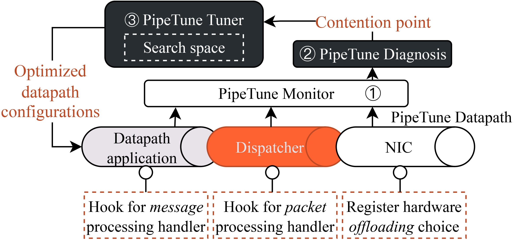

# PipeTune
PipeTune is an efficient performance tuning framework for host datapaths. It correlates three crucial datapath configurations (i.e., core number, queue number and batch size) with memory efficiency, further translating to datapath performance to derive effective tuning strategies. Building upon them, we implemented PipeTune to automatically search for the optimal configuration values to achieve consistently high performance.

The detail of PipeTune is described in our paper: [Tuning Host Datapath Performance with PipeTune](https://github.com/Huangxy-Minel/Paper-DPerf).

<!-- ----------------------------------------------------------------- -->
[TOC]

## 1. Features
- **Datapath**: PipeTune datapath provides two types of emulation hooks, i.e., message-based handler and packet-based handler, to emulate real-world applications.
- **Tuner**: PipeTune can automatically search for the optimal configuration values of core number, queue number and batch size.

The following figure shows the architecture of PipeTune.
<div style="text-align: center;">

</div>

Note that the **emulation module can be used individually**, e.g., emulate the performance of a specific application or used as a perf-test tool.

<!-- ----------------------------------------------------------------- -->

## 2. Quick Start
The following instructions will help you to quickly set up PipeTune on your machine. 

### Test Environment
- Ubuntu 22.04
- Linux kernel 5.15.x
- DPDK 22.11.x
- Intel(R) Xeon(R) Silver 4309Y CPU @ 2.80GHz
- two-port 200G Ethernet Mellanox Connect-X 7
- PCIe 4.0 x 16
- 512GB DDR5 3200MT/s

### Install Prerequisites
Install with package manager (e.g., apt):
```bash
bash init_dependencies.sh
```
Install DPDK, if you have not installed it:
```bash
tar -xvf third_party/dpdk-22.11.3.tar.xz
bash third_party/build_dpdk.sh
```
Install Mellanox OFED, if you have not installed it. Please refer to the [official website](https://www.mellanox.com/products/infiniband-drivers/linux/mlnx_ofed) for installation.

**Important**: 
- Modify src/common.h to set the Node Type (CLIENT or SERVER) and the Dispatcher Type (DPDK or RoCE). Update the server constants to your own servers.
- Modify config/send_config (for CLIENT) and config/recv_config (for SERVER) to set source and destination IP/MAC addresses and PCIe device ID. Currently, please replace all ':' to '.' for MAC addresses and PCIe device ID.

### Build PipeTune
PipeTune can be easily built if you have installed the prerequisites. 
```bash
meson setup build
ninja -C build
```
**Troubleshooting**: If you encounter any issues during the build process, please refer to the [Troubleshooting](#trouble) section.

### Run PipeTune Datapath Individually
Start the PipeTune server first, then client.
```bash
sudo build/pipetune > temp.log
```
If success to run, you will see the following performance metrics:
```bash
---------------------------------------------------------------------------------------------------------------------------------------------------------------------------------------------------------------
Perf Statistics    Thpl. (Mpps)        Avg. [/P]           Avg. Stall [/P]     Max Stall. [/B]     Min Stall. [/B]     Avg Stall. [/B]     Max Coml. [/B]      Min Coml. [/B]      Avg Coml. [/B]      
---------------------------------------------------------------------------------------------------------------------------------------------------------------------------------------------------------------
End-to-end          0.000               0.000               
app_tx              48.205              0.017               0.003               3.088               0.061               0.087878(0.258139)  21.997              0.259               0.456               
app_rx              48.205              0.013               0.000               0.000               9999.000            0.000               8.025               0.361               0.771               
disp_tx             48.205              0.014               0.008               
disp_rx             48.205              0.023               0.009               
nic_tx              48.205              0.008          
nic_rx              33.477              0.120          
---------------------------------------------------------------------------------------------------------------------------------------------------------------------------------------------------------------
```

<!-- ----------------------------------------------------------------- -->

## 3. Customize PipeTune Datapath
This section provides a detailed guide on how to customize PipeTune datapath for your own applications, i.e., emulate the applications with message-based handler and packet-based handler.

### Hook Handler to PipeTune Datapath
#### Message-based Handler
1. Implement the message-based handler in 'src/ws_impl/msg_handlers.cc' and define the handler in 'src/workspace.h'. 
```cpp
template <class TDispatcher>
void Workspace<TDispatcher>::throughput_intense_app(MEM_REG_TYPE **mbuf_ptr, size_t pkt_num, udphdr *uh, ws_hdr *hdr) {
    for (size_t i = 0; i < pkt_num; i++) {
    // [step 1] scan the payload of the request
    scan_payload(*mbuf_ptr, kAppPayloadSize);

    // [step 2] set the payload of a response with same size
    #if ApplyNewMbuf
        cp_payload(tx_mbuf_buffer_[i], *mbuf_ptr, (char*)uh, (char*)hdr, 1);
        mbuf_ptr++;
    #else
        set_payload(*mbuf_ptr, (char*)uh, (char*)hdr, 1);
        mbuf_ptr++;
    #endif
    }
}
```
2. Register the message-based handler in 'src/common.h'. 
```cpp
enum msg_handler_type_t : uint8_t {
  kRxMsgHandler_Empty = 0,
  kRxMsgHandler_T_APP,
  kRxMsgHandler_L_APP,
  kRxMsgHandler_M_APP,
  kRxMsgHandler_FileDecompress,
  <Your Handler Type>
};
```
3. Change the message-based handler type (kRxMsgHandler) and set the application payload size (kAppPayloadSize) in 'src/common.h'.
```cpp
/* Message-level specification */
#define kRxMsgHandler <Your Handler Type>
#define ApplyNewMbuf false
static constexpr size_t kAppTicksPerMsg = 0;    // extra execution ticks for each message, used for more accurate emulation
// Corresponding MAC frame len: 22 -> 64; 86 -> 128; 214 -> 256; 470 -> 512; 982 -> 1024; 1458 -> 1500
constexpr size_t kAppPayloadSize = 
    (kRxMsgHandler == kRxMsgHandler_Empty) ? 0 :
    (kRxMsgHandler == kRxMsgHandler_T_APP) ? 982 :
    (kRxMsgHandler == kRxMsgHandler_L_APP) ? 86 :
    (kRxMsgHandler == kRxMsgHandler_M_APP) ? 86 :
    (kRxMsgHandler == kRxMsgHandler_FileDecompress) ? MB(2) : 0 :
    (kRxMsgHandler == kRxMsgHandler_<Your Handler Type>) ? <Your Payload Size> : 0;
static_assert(kAppPayloadSize > 0, "Invalid application payload size");
```

#### Packet-based Handler
1. For dpdk dispatcher, implement the packet-based handler in 'src/dispatcher_impl/dpdk/dpdk_pkt_handlers.cc' and define the handler in 'src/dispatcher_impl/dpdk/dpdk_dispatcher.h'. RoCE dispatcher is similar to dpdk dispatcher.
```cpp
size_t DpdkDispatcher::echo_handler() {
    size_t pre_dispatch_total = 0;
    rte_mbuf *mbuf;
    struct eth_hdr *eth = NULL;
    struct iphdr *iph = NULL;

    uint8_t tmp_eth_addr[ETH_ADDR_LEN] = {0};
    uint32_t tmp_ip_addr = 0;

    size_t remain_tx_queue_size = (kNumTxRingEntries - tx_queue_idx_ > rx_queue_idx_) 
                                    ? rx_queue_idx_ : kNumTxRingEntries - tx_queue_idx_;
    for (size_t i = 0; i < remain_tx_queue_size; i++) {
    mbuf = rx_queue_[i];
    eth = mbuf_eth_hdr(mbuf);
    iph = mbuf_ip_hdr(mbuf);

    // swap IP address
    tmp_ip_addr = iph->daddr;
    iph->daddr = iph->saddr;
    iph->saddr = tmp_ip_addr;

    // swap MAC address
    rte_memcpy(tmp_eth_addr, eth->d_addr.bytes, ETH_ADDR_LEN);
    rte_memcpy(eth->d_addr.bytes, eth->s_addr.bytes, ETH_ADDR_LEN);
    rte_memcpy(eth->s_addr.bytes, tmp_eth_addr, ETH_ADDR_LEN);

    // insert packets to tx queue
    tx_queue_[tx_queue_idx_] = mbuf;
    tx_queue_idx_++;

    pre_dispatch_total++;
    }
    for (size_t i = pre_dispatch_total; i < rx_queue_idx_; i++) rte_pktmbuf_free(rx_queue_[i]);
    rx_queue_idx_ = 0;
    return pre_dispatch_total;
}
```
2. Register the packet-based handler in 'src/common.h'. 
```cpp
enum pkt_handler_type_t : uint8_t {
  kRxPktHandler_Empty = 0,
  kRxPktHandler_Echo,
  <Your Handler Type>
};
```
3. Change the packet-based handler type (kRxPktHandler) in 'src/common.h'.
```cpp
/* Packet-level specification */
#define kRxPktHandler  <Your Handler Type>
```

### Customize Config File
Please refer to the 'config/template_config' to customize the configuration file for your own applications. Note that Sec 'PipeTune Tuner Configuration' is used for PipeTune tuner, so you can ignore it if you only want to customize the datapath. The Sec 'PipeTune Datapath Configuration' is used for PipeTune datapath.

### Rebuild and Run PipeTune Datapath
```bash
ninja -C build
sudo build/pipetune > temp.log
```
Hope you can enjoy the customization of PipeTune datapath!

<!-- ----------------------------------------------------------------- -->

## 4. PipeTune Tuner (Coming Soon)
This section provides a detailed guide on how to use PipeTune tuner to search for the optimal configuration values of core number, queue number and batch size.

## <a name="trouble"></a>Troubleshooting


